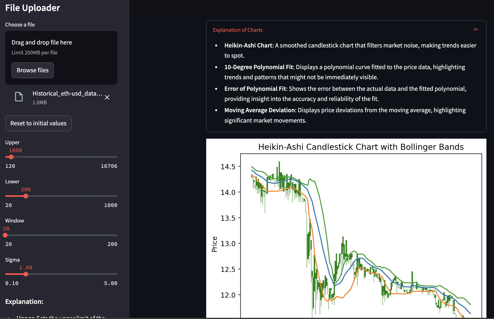
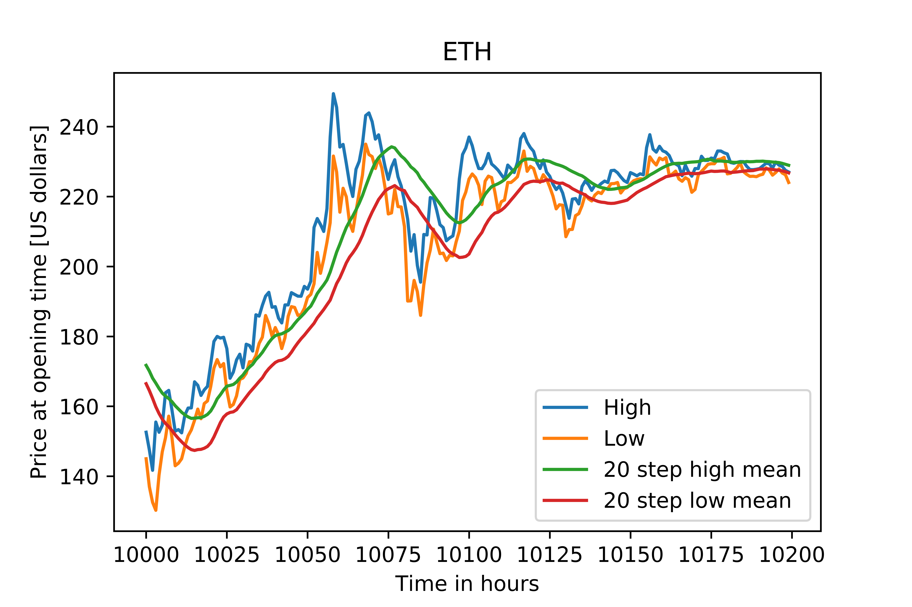
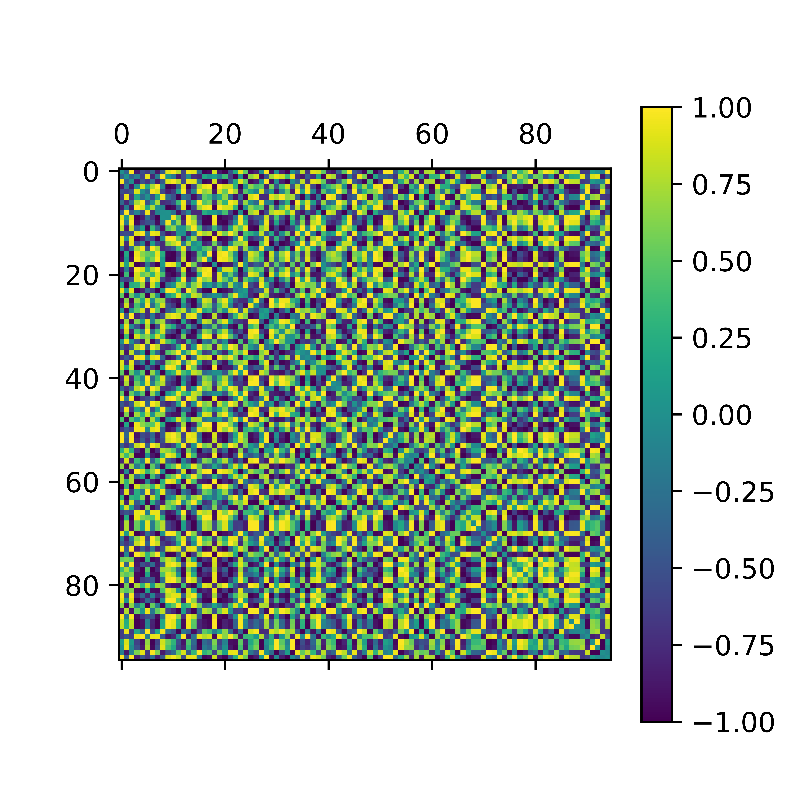
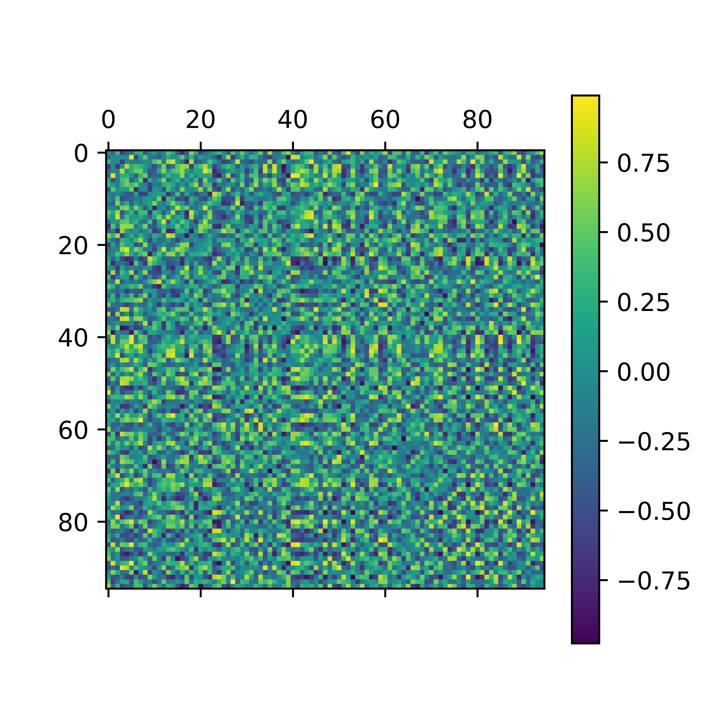
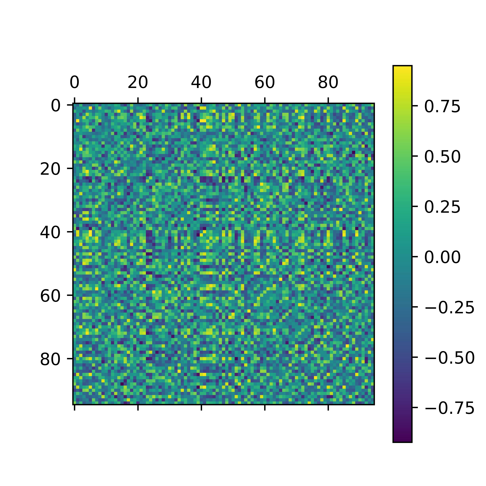
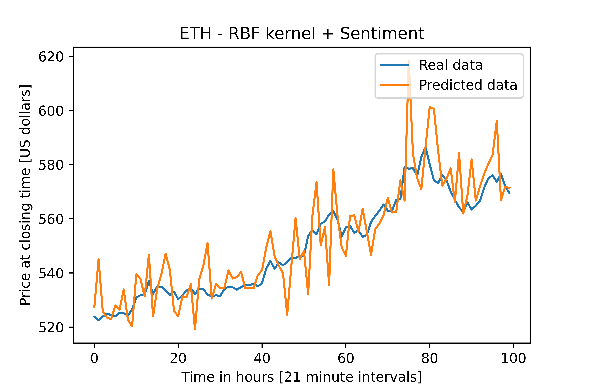

# Crypto-market Streamlit App


Streamlit application that provides an interactive and intuitive control panel, allowing users to explore and analyze cryptocurrency market data with adjustable parameters.
**Explore this app live [here](https://share.streamlit.io/app/ethboiler/)**

### Features and Controls

The Streamlit app offers the following controls:

1. **Upper Value Slider** (`Upper`):
   - **Purpose**: This slider allows the user to set an upper limit for the dataset range they want to analyze.
   - **Functionality**: By adjusting this slider, users can focus on a specific upper bound of the data, effectively narrowing down the range of historical data they are examining. This is particularly useful for focusing on more recent data or a specific time period.

2. **Difference Slider** (`Lower`):
   - **Purpose**: This slider sets the difference (or range) between the upper limit and a derived lower limit.
   - **Functionality**: Users can control the span of data they wish to analyze by adjusting the difference between the upper and lower bounds. This helps in zooming into specific intervals of data where significant changes might have occurred.

3. **Window Size Slider** (`Window`):
   - **Purpose**: This slider allows the user to set the size of the moving window for calculating the moving average of the price range.
   - **Functionality**: By adjusting the window size, users can analyze the data with different levels of smoothness. A smaller window size will make the analysis more sensitive to short-term fluctuations, while a larger window size will smooth out these fluctuations, highlighting longer-term trends.

4. **Sigma Slider** (`Sigma`):
   - **Purpose**: This slider controls the sensitivity of the deviation analysis, particularly influencing the threshold for detecting significant deviations from the moving average.
   - **Functionality**: Users can adjust the `Sigma` value to fine-tune the detection of price spikes. A lower sigma value makes the system more sensitive to minor deviations, while a higher value focuses only on major deviations. This is useful for identifying significant market events or price anomalies.

### Interactive Analysis

- **Real-Time Adjustments**: As users adjust these sliders, the app recalculates the moving averages, deviations, and any other relevant metrics in real-time. This allows users to see immediate feedback and understand how different parameters affect the analysis.
- **Reset Functionality**: Users can reset all the sliders to their initial default values with a single button click, allowing for a quick return to the baseline settings.

## Requirements

To run this application, you need the following Python packages:

- `streamlit`

## Installation

1. **Clone the repository** (if you are using a version control system like Git):

    ```bash
    git clone <your-repo-url>
    cd <your-repo-directory>
    ```

2. **Create a virtual environment** (optional but recommended):

    ```bash
    python3 -m venv venv
    source venv/bin/activate  # On Windows use `venv\Scripts\activate`
    ```

3. **Install the required packages**:

    ```bash
    pip install requirements.txt
    ```

## Running the App

To run the app, execute the following command in your terminal where app.py and the data is located:

```bash
streamlit run app.py
```

## Other scripts

The repository also includes a script to pull historical data from gdax's API and save into a CSV file locally to facilitate the exploration of this data. The API limits the amount of data that one can pull per second.


Exploring spikes in the change of price:

The script titled Plotting_moving_average.py calculates the absolute change of the crypto price per time stamp ( |High price - Low price| ) for a give time data series, this is given by the name "range". After this it calculates the moving average of the range for a given time window. The window is 20 time steps of the time series data time step which for this example is 1 hour. We calculate this for every single point in time.

Following this we analyze point by point comparing if it deviates significantly from the mean of the previous specified time window. For this a sigmoind function of the form 1/(1 + exp((Intensity * Mean_of_the_previous_time_window) - x) is used, where x is the point being analyzed. In this example the varaible Intensity serves as a way to determine how significant the deviation should be. All points that make this function have a value higher than 0.5 are recorded for an Intensity equal to 4.


In the image above the first row shows an extract of Ethereum high and low price values, the second row shows the range (diference between high and low) of the first row, finally the third row shows the deviation of each point to the moving average of 20 time steps. The y axis of the third row is the value of the sigmoind function described above. From the image above one can see that there is only one point with a value higher than 0.5 which would be recored for further analysis described in the following paragrahps.

Below are matrixes comparing the set of the n previous points of the (95) points that have met the criteria above. These matrixes compare one set of points to another set to see if there exists any correlations among them, therefore exploring if there are any patterns that may indicate when a spike might occure.

Matrix of Pearson correlation between sets of 3 points before spike:


Matrix of Pearson correlation between sets of 5 points before spike:


Matrix of Pearson correlation between sets of 7 points before spike:


Matrix of Pearson correlation between sets of 10 points before spike:


Additionaly predicted the moving of prices using RBF kernel within a Support Vector Machine:


More to come:
I will soon be uploading the different types of curves with high probability of inducing a spikes
