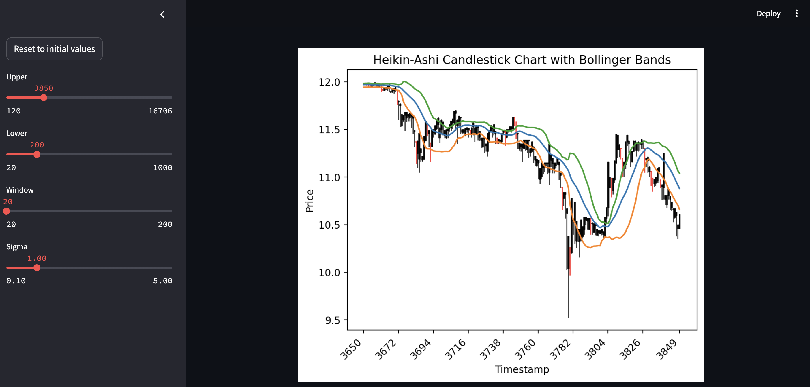
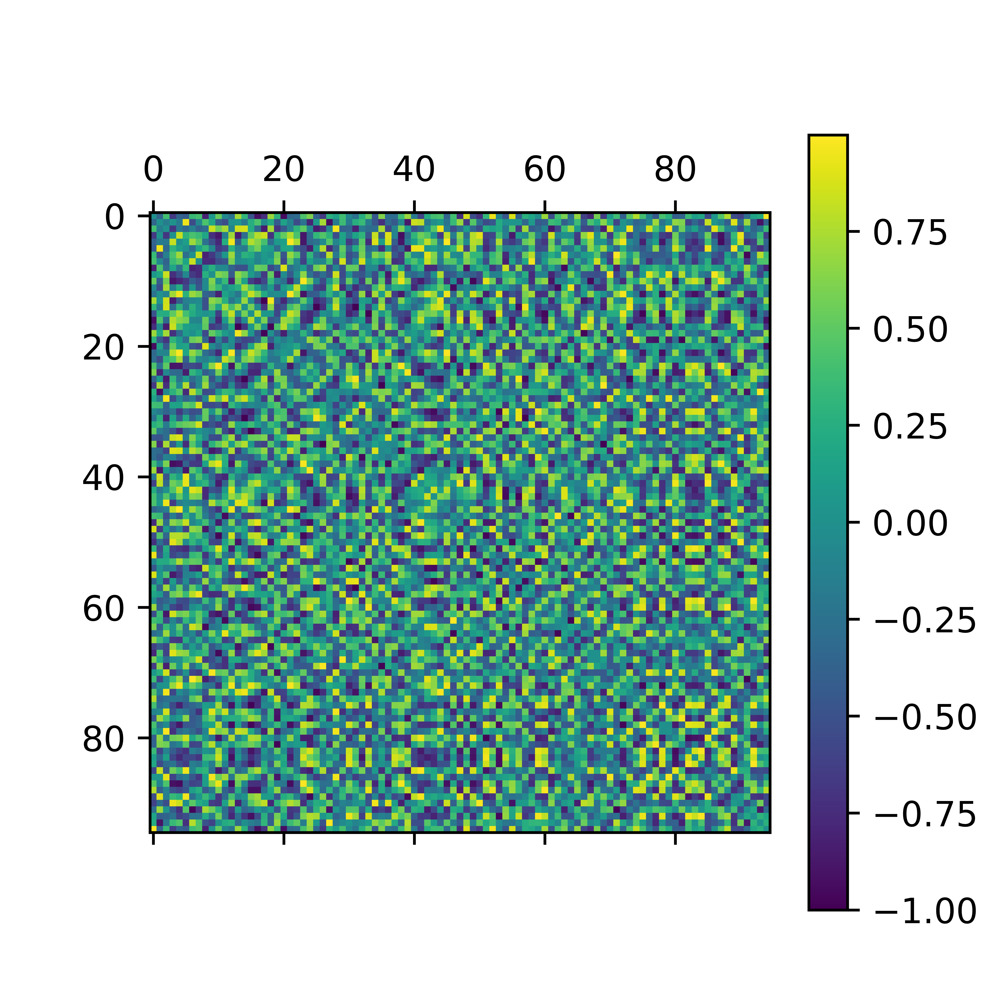

# Crypto-market


Script will pull historical data from gdax's API and save into a CSV file locally to facilitate the exploration of this data. The API limits the amount of data that one can pull per second.

Exploring spikes in the change of price:

The script titled Plotting_moving_average.py calculates the absolute change of the crypto price per time stamp ( |High price - Low price| ) for a give time data series, this is given by the name "range". After this it calculates the moving average of the range for a given time window. The window is 20 time steps of the time series data time step which for this example is 1 hour. We calculate this for every single point in time.

# Streamlit App

There is a Streamlit application that provides an interactive control panel with sliders. You can reset the sliders to their initial values by pressing a button.

## Requirements

To run this application, you need the following Python packages:

- `streamlit`

## Installation

1. **Clone the repository** (if you are using a version control system like Git):

    ```bash
    git clone <your-repo-url>
    cd <your-repo-directory>
    ```

2. **Create a virtual environment** (optional but recommended):

    ```bash
    python3 -m venv venv
    source venv/bin/activate  # On Windows use `venv\Scripts\activate`
    ```

3. **Install the required packages**:

    ```bash
    pip install streamlit
    ```

## Running the App

To run the app, execute the following command in your terminal:

```bash
streamlit run app.py
```

Following this we analyze point by point comparing if it deviates significantly from the mean of the previous specified time window. For this a sigmoind function of the form 1/(1 + exp((Intensity * Mean_of_the_previous_time_window) - x) is used, where x is the point being analyzed. In this example the varaible Intensity serves as a way to determine how significant the deviation should be. All points that make this function have a value higher than 0.5 are recorded for an Intensity equal to 4.


In the image above the first row shows an extract of Ethereum high and low price values, the second row shows the range (diference between high and low) of the first row, finally the third row shows the deviation of each point to the moving average of 20 time steps. The y axis of the third row is the value of the sigmoind function described above. From the image above one can see that there is only one point with a value higher than 0.5 which would be recored for further analysis described in the following paragrahps.

Below are matrixes comparing the set of the n previous points of the (95) points that have met the criteria above. These matrixes compare one set of points to another set to see if there exists any correlations among them, therefore exploring if there are any patterns that may indicate when a spike might occure.

Matrix of Pearson correlation between sets of 3 points before spike:


Matrix of Pearson correlation between sets of 5 points before spike:


Matrix of Pearson correlation between sets of 7 points before spike:


Matrix of Pearson correlation between sets of 10 points before spike:


Additionaly predicted the moving of prices using RBF kernel within a Support Vector Machine:


More to come:
I will soon be uploading the different types of curves with high probability of inducing a spikes
